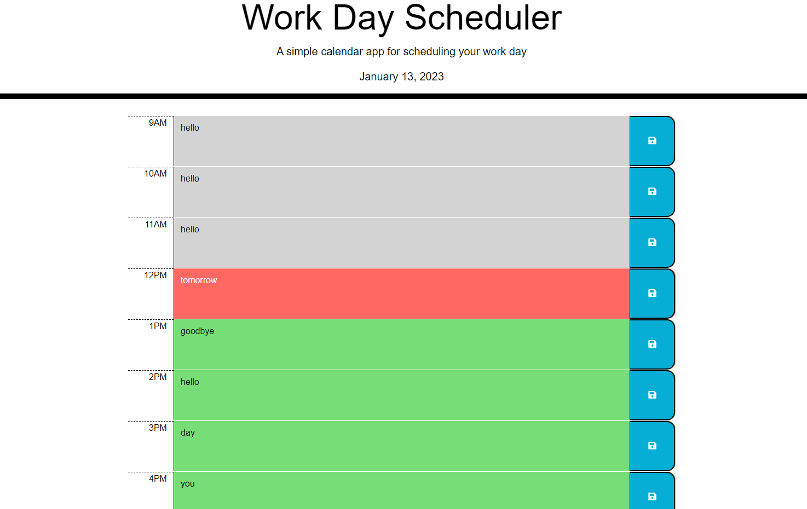

# <Daily Planner>

## Description

This application was created to help users neatly plan their daily tasks. With this in mind and using the provided started code I used a combination of jquery and DayJS to implement date and time aspects to the page. Upon visiting the page users will be greeted today's date and they can use the input fields to carefully plan their day. Times should be color coded depending on if they are in the past, present or future.

## Installation

Visit: 

## Usage

Input your daily tasks in the provided fields and then click the save button to save your tasks. When the website is revisited tasks should have remained in place.

## how does it look:

## Credits

Starter Code: https://github.com/coding-boot-camp/crispy-octo-meme.git

## License

---